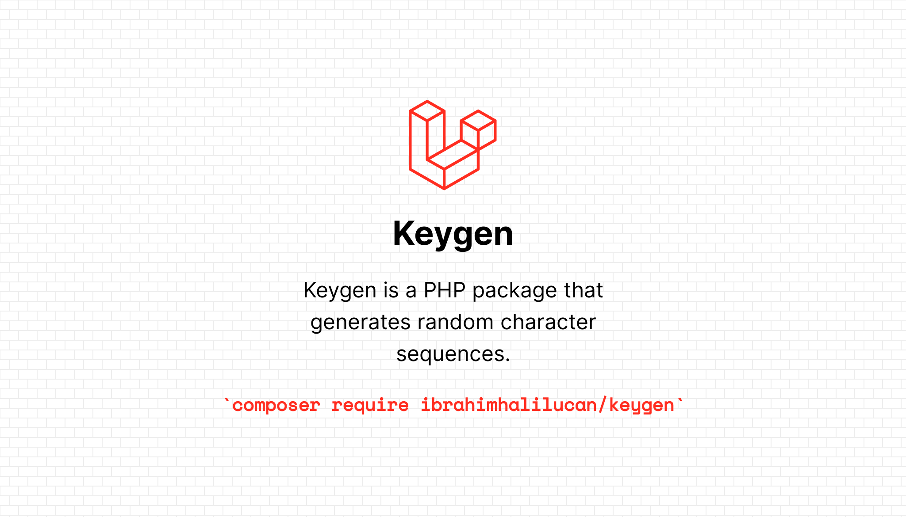

## Keygen

Keygen is a PHP package that generates random character sequences.
## Requirement

> Laravel >= 9.0
>
>  Php >= 8.0.0

## Installation

You can install the package via composer:

```bash
$ composer require ibrahimhalilucan/keygen
```

## Usage
To import the right class:
```php
use IbrahimHalilUcan\Keygen\Keygen;
```

### Alphabet
```php
// Generates a random string based on the preset ASCII codes, prefix and suffix
// e.g ucdftrvs

Keygen::alphabet()->generate(); // e.g uomucgny
Keygen::alphabet()->length(5)->generate(); // e.g uaeem
Keygen::alphabet()->alpha()->generate(); // e.g lksEFGsC
Keygen::alphabet()->alphaLowerCase()->generate(); // e.g wfhilspk
Keygen::alphabet()->alphaUpperCase()->generate(); // e.g CIZKNJDF
Keygen::alphabet()->lower()->generate(); // e.g bibdbbiv
Keygen::alphabet()->upper()->generate(); // e.g XSJQWUGT
Keygen::alphabet()->numeric()->generate(); // e.g 55478739
Keygen::alphabet()->alphaNumeric()->generate(); // e.g 8k1Egrab
Keygen::alphabet()->prefix('ihu-')->suffix('-pi')->generate(); // e.g ihu-bapcqajv-pi"
Keygen::alphabet()->specialCharacters()->generate(); // e.g &'],\*+)
```

### Float
```php
// Generate a random float between min and max (considering $min and $max attribute)
// e.g 85.38

Keygen::float()->generate(); // e.g 17.25
Keygen::float()->min(4)->decimals(2)->generate(); // e.g 74.74
Keygen::float()->max(45)->decimals(2)->generate(); // e.g 1.26
Keygen::float()->min(4)->max(45)->generate(); // e.g 42.09

```

### Integer
```php
// Generate a random int between min and max (considering $min and $max attribute)
// e.g 5423

Keygen::numeric()->generate(); // e.g 84184
Keygen::numeric()->min(4)->generate(); // e.g 64321
Keygen::numeric()->max(45)->generate(); // e.g 41
Keygen::numeric()->min(4)->max(45)->generate(); // e.g 36
```

### Serial
```php
// Generates a random string based on the preset ASCII codes, prefix, suffix, parts, and separator.
// e.g thabif-ndqtmh-zekdoq-vlgpob

Keygen::serial()->generate(); // e.g puqtfa-vuxpct-lmhqkm-grxgoz
Keygen::serial()->alpha()->generate(); // e.g QjHDNT-KQmHGj-WDKFOu-CmICNC
Keygen::serial()->lower()->generate(); // e.g bqrgag-ggmguz-swwzil-tzbtrv
Keygen::serial()->upper()->generate(); // e.g JBAPMP-UWAQOC-GEZZQL-FRFXOP
Keygen::serial()->numeric()->generate(); // e.g 818299-843464-198220-761544
Keygen::serial()->alphaNumeric()->generate(); // e.g BabsKi-Xyvvv8-mZIRpm-5LcDyq
Keygen::serial()->length(4)->parts(8)->generate(); // e.g diso-buvg-gsdg-gjca-mqay-vtxy-ovre-nzth
Keygen::serial()->prefix('ihu-')->suffix('-pi')->generate(); // e.g ihu-yvyqar-bpwcdp-zskntq-xdirar-pi
```

### Token
```php
// Generates a random token using base64 encoding and str_shuffle.
// e.g f/Oio2HmQID6Pd1SW6kQkDtzCFbgLaG0z+0/Z3R0iiG/bHeJlyFq330/npFq2A6S

Keygen::token()->generate(); // e.g H8dtuud/5OZatJgv9JEclexIO87EjzFi2mfiKNO7opit/LQdhvpuTPGG5lUnIbaZ
Keygen::token()->length(32)->generate(); // e.g 6oEumsgigVtla4LtUVQ4jogGtYyw5gl1"
Keygen::token()->prefix("ihu-")->suffix("-pi")->generate(); // e.g ihu-Y9gbdyInr4TIyXu+r+tLMt6H1uSWQx73zSA8qaB9zx/nFQnasNjaIoS60wue6iYV-pi
```

## Changelog

Please see [CHANGELOG](CHANGELOG.md) for more information what has changed recently.

## Contributing
Any ideas are welcome. Feel free to submit any issues or pull requests.
Please see [CONTRIBUTING](CONTRIBUTING.md) for details.

## Security

If you discover any security related issues, please email ibrahimhalilucan@gmail.com instead of using the issue tracker.

## Credits

- [İbrahim Halil Uçan](https://github.com/ibrahimhalilucan)

## License

The MIT License (MIT). Please see [License File](LICENSE) for more information.
